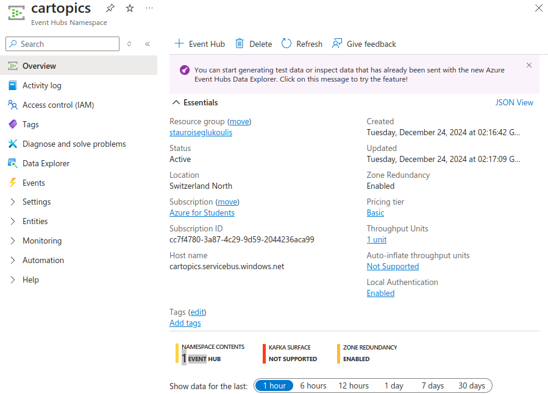
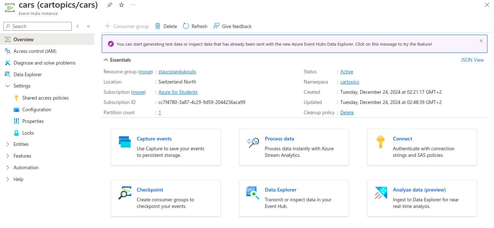

# DistributedSystemProject
Project for the first semester course in Distributed System 


# Develop with Kafka and Pyspark locally 

Run zookeeper, kafka's orchestrator: 
```
docker run -d --name zookeeper -p 2181:2181     -e ZOOKEEPER_CLIENT_PORT=2181     confluentinc/cp-zookeeper
```

Run kafka, the queuing system: 

```
docker run -d --name kafka -p 9092:9092 \
    -e KAFKA_ZOOKEEPER_CONNECT=zookeeper:2181 \
    -e KAFKA_ADVERTISED_LISTENERS=PLAINTEXT://localhost:9092 \
    -e KAFKA_LISTENERS=PLAINTEXT://0.0.0.0:9092 \
    --link zookeeper \
    confluentinc/cp-kafka

```

This should install and build locally.

## Create a topic 

```
docker exec -it kafka kafka-topics --create --topic test-topic --bootstrap-server localhost:9092 --partitions 1 --replication-factor 1
```

## List topics 

```
docker exec -it kafka kafka-topics --list --bootstrap-server localhost:9092
```

## Remove topic 

```
docker exec -it kafka kafka-topics --delete --topic test-topic --bootstrap-server localhost:9092
```

# Postgresql instance 

You can connect to the instance using the following URL: 

```
jdbc_url = f"jdbc:postgresql://distributed.postgres.database.azure.com:5432/postgres?user={env_values['PGUSER']}&password={env_values['PGPASSWORD']}&sslmode=require"
db_properties = {
    "user": env_values["PGUSER"],
    "password": env_values["PGPASSWORD"],
    "driver": "org.postgresql.Driver",
    "sslmode": "require"
}
```

Note that the `'PGUSER'` and `'PGPASSWORD'` environment should be read from a `.env` file inside the root directory or set as environment variables.


# Cloud deployment 


## Kafka 

Create a new namespace using Azure's event hub: 




Kafka config to connect to the `Event Hub Namespace`.

```
bootstrap.servers=NAMESPACENAME.servicebus.windows.net:9093
security.protocol=SASL_SSL
sasl.mechanism=PLAIN
sasl.jaas.config=org.apache.kafka.common.security.plain.PlainLoginModule required username="$ConnectionString" password="{YOUR.EVENTHUBS.CONNECTION.STRING}";
```

Create a new event hub: 



Kafka config to connect to a specific event hub: 

```
   from kafka import KafkaProducer

   # Replace with your Event Hubs connection string
   producer = KafkaProducer(bootstrap_servers=['<your_event_hub_namespace>.servicebus.windows.net:9093'],
                            security_protocol='SASL_SSL',
                            sasl_mechanism='PLAIN',
                            sasl_plain_username='$ConnectionString',
                            sasl_plain_password='<your_connection_string>')

   for _ in range(50):
       producer.send('<your_event_hub_name>', b'test message')
   
```


We should use the confluent kafka: 
- Setup: https://github.com/Azure/azure-event-hubs-for-kafka/blob/master/quickstart/python/setup.sh
- Producer: https://github.com/Azure/azure-event-hubs-for-kafka/blob/master/quickstart/python/producer.py
- Consumer: https://github.com/Azure/azure-event-hubs-for-kafka/blob/master/quickstart/python/consumer.py