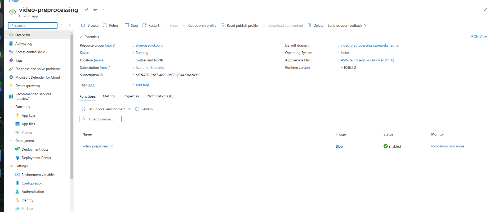
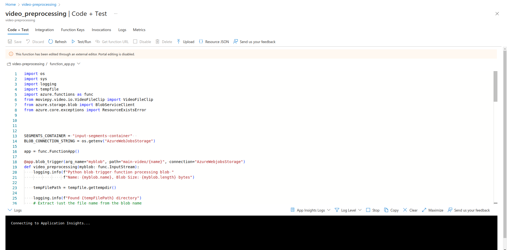
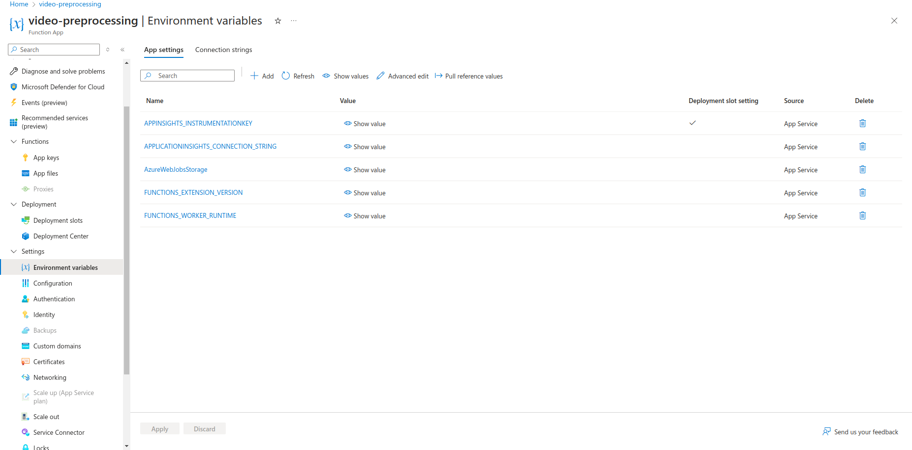
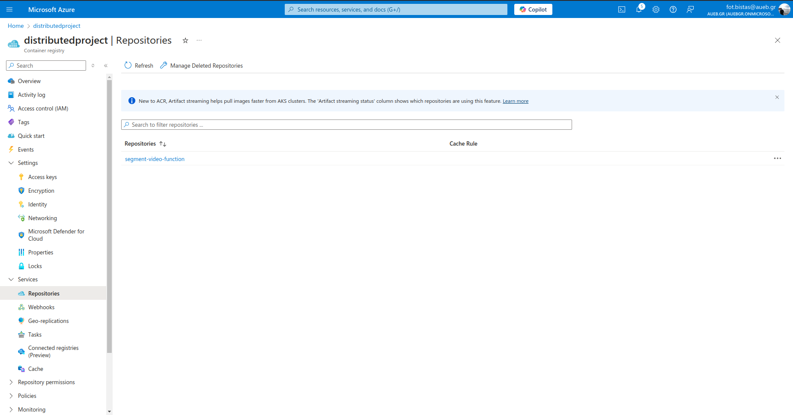
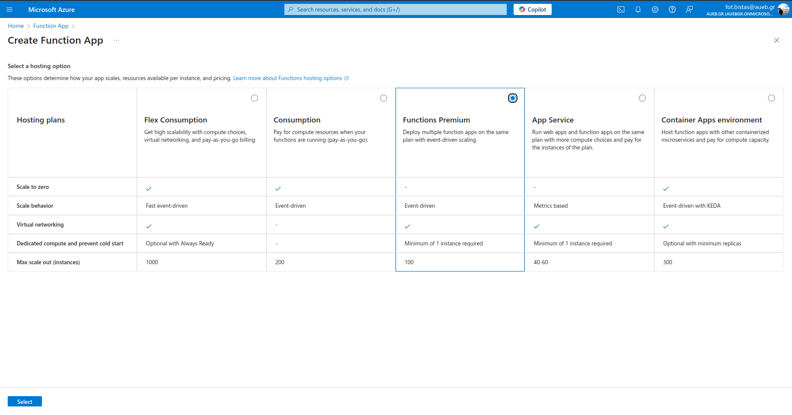
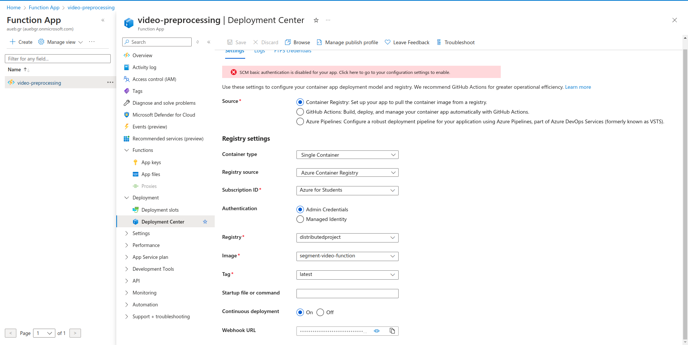

# DistributedSystemProject
Project for the first semester course in Distributed System 


# Upload the function to Azure Function app 
Each directory is a seperate function app. The preprocessing directory segments the video and uploads them into the `input-segments-container`.

Test if function app works locally:

```
func start
```

Publish the function app to the cloud: 

```
func azure functionapp publish video-preprocessing --python --force
```
Force rebuilds the app.

You should see it in the overview page of the function app: 




Clicking on the function you are able to see it's code, it's logs and debug it: 




You can set environment variables here: 



# FunctionApp using the Azure Container Registry

Login into azure using: 

```
az login
```

Login into the container registry using: 

```
az acr login --name <container_registry_name>
```

Build the image locally: 

```
docker build -t <image_name:tag> --name <container_registry_name> ./
```

Check if it runs correctly locally: 

```
docker run -e AzureWebJobsStorage=<value> -p 8080:80 <image_name:tag> 
```

Push the image to the cloud: 

```
docker push <container_registry_name>.azurecr.io/<image_name:tag>
```

You should be able to see it in the Container Registry's Repository section:




After this create a FunctionApp using the premium pricing plan: 




Choose the option for the FunctionApp to be always on and go to the deployments section: 




Select the desired image and registry.

You should be able to see it running in the overview: 


# Running the files with environment variables 

If you are planning to run a simple python file: 

```
POSTGRES_HOST=localhost POSTGRES_PORT=5432 POSTGRES_DB=your_db POSTGRES_USER=your_user POSTGRES_PASSWORD=your_password python create_log_file.py
```


If you are running a function app, ensure the `local.settings.json` contains: 

```
{
  "IsEncrypted": false,
  "Values": {
    "FUNCTIONS_WORKER_RUNTIME": "python",
    "AzureWebJobsStorage":"connection_string",
    "POSTGRES_HOST": "localhost",
    "POSTGRES_PORT": "5432",
    "POSTGRES_DB": "your_db",
    "POSTGRES_USER": "your_user",
    "POSTGRES_PASSWORD": "your_password"
  },
  "ConnectionStrings": {}
}
```
